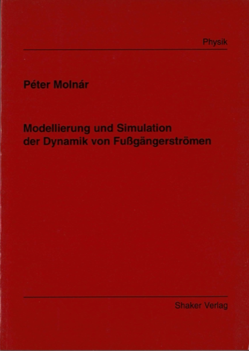

# Social Force Model for Pedestrian Simulation
Source code of the simulation program for my dissertation work.

I wrote this code over 20 years ago. Just when C++ became popular...and available for DEC Ultrix.
Maybe some of the pieces are useful.

